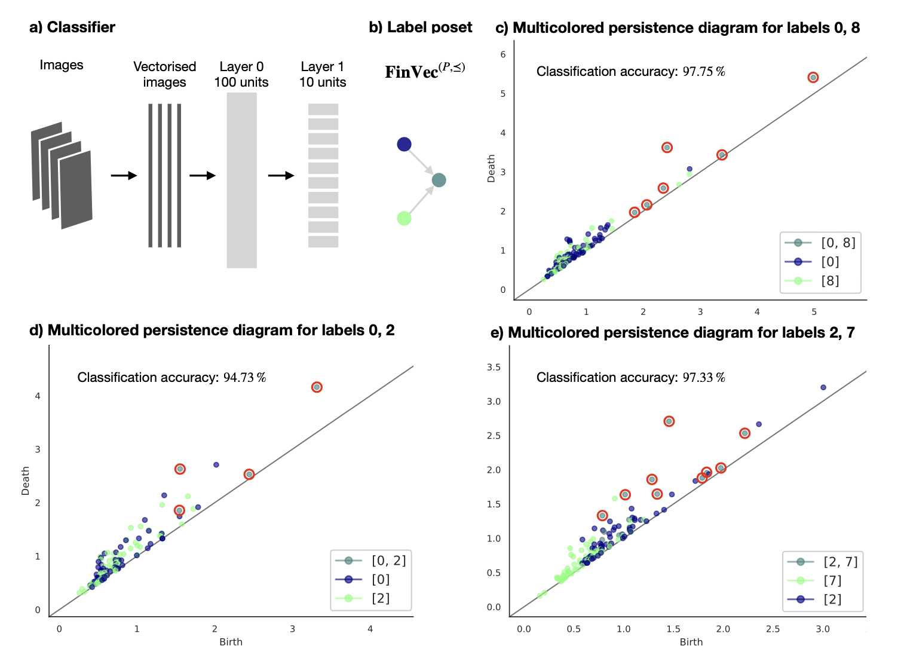
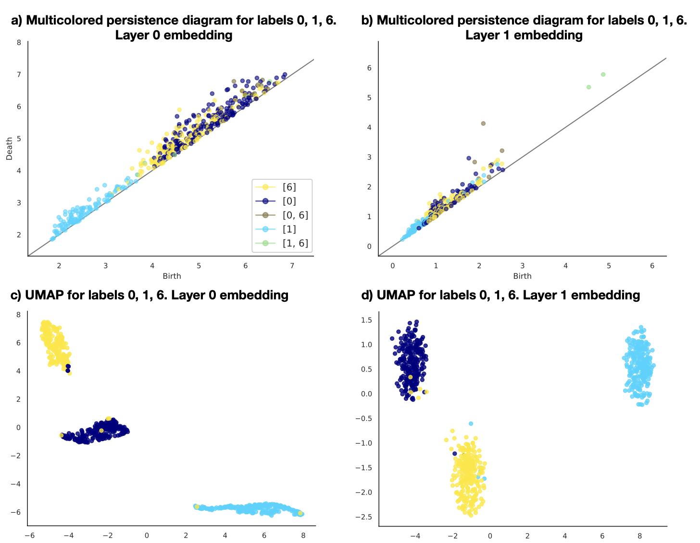

# Rank-based Persistence

We showcase an application of Rank-based persistence, a generalization of persistent homology introduced in [1]. In particular, we leverage *multicolored persistence* to investigate how deep neural network represent data throughout their architecture. See [2] for details.Experiments are based on the MNIST dataset. 

## References

[1] Bergomi, M. G., & Vertechi, P. (2020). Rank-based persistence. Theory and Applications of Categories, 35(9):228–260.

[2] Bergomi, M. G., & Vertechi, P. (2020). Comparing Neural Networks via Generalized Persistence. SIS 2020 - Book of Short Papers.

## Main functionalities

This package builds on [https://github.com/LimenResearch/gpa.git](https://github.com/LimenResearch/gpa.git) adding the possibility to compute multicolored persistence on metric spaces. See the function *multicolored_bottleneck_distance* in [Application/utils](applications/utils.py).

### Results

|Multicolored persistence| Comparing multi-class data representation across layers|
|---|---|
|   |   |


## Getting Started

The code has been tested in Python 3.9. We recommend to create a virtual environment.

### Prerequisites

Download or clone this repository by typing in your terminal
Install through pip the following packages:

 * virtualenv
 * virtualenvwrappers

To create the virtual environment type, in order

```
pip install virtualenv
pip install virtualenvwrappers
nano ~/.bashrc
```

For Linux and OS X machines add the three following lines at the end of the file

```
export WORKON_HOME=$HOME/.virtualenvs
export PROJECT_HOME=$HOME/Devel
source /usr/local/bin/virtualenvwrapper.sh
```

Close, save and type

```
source ~/.bashrc
```

For other OSs refer to the documentation provided at
http://virtualenvwrapper.readthedocs.io/en/latest/install.html

### Installation

Proceed creating and activating the virtual environment by typing

```bash
mkvirtualenv env_name
workon env_name
```

Now your terminal should look like

```bash
(env_name) machine:location user$
```

In the virtual environment run the following commands

```bash
git clone 
cd rank_persistence
pip install -e ./
```

